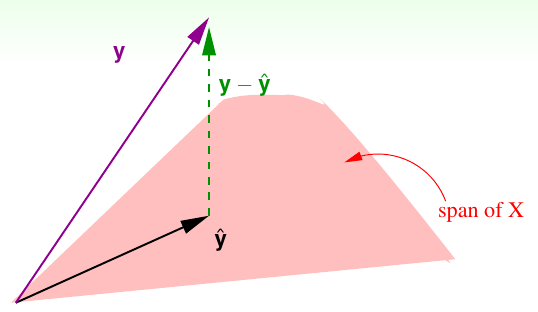
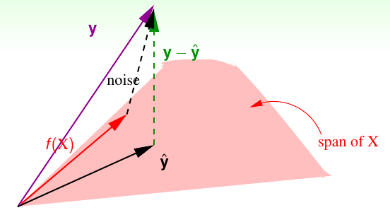
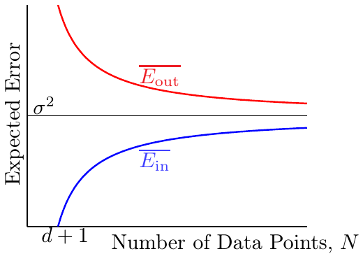
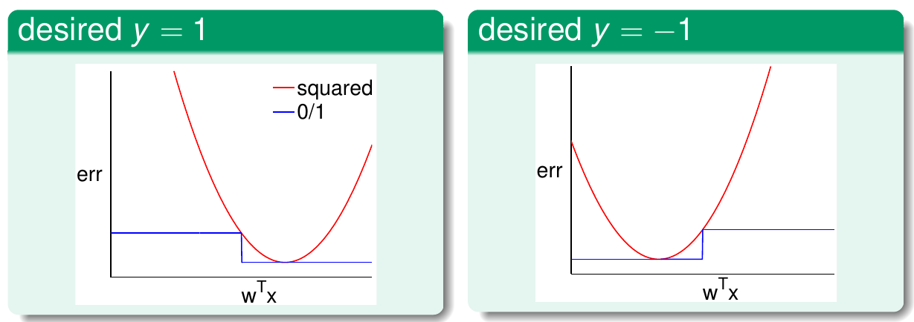

## 线性回归

回归是指学习任务的预测目标是连续值。如根据银行客户的信息预测该这个客户的信用卡额度就是一个回归任务。
假设客户有d个属性，表示为$x=(x_1，x_2,...,x_d)$线性回归试图学得一个
通过属性的线性组合来进行预测的函数,即：

$$h(x) = w_1x_1 + w_2x_2 + ... + w_dx_d + b$$

一般用向量的形式写成

$$h(x) = w^Tx+b$$

如果我们在$x$向量中加入一个分量1，使$x$=(1;x_1;x_2;...;x_d)，那么可以把b吸收进权值向量$w$，线性回归的函数就是：

$$h(x)=w^Tx$$

当$x$是一维向量的时候$h(x)$是一条直线，当$x$是二维向量的时候，$h(x)$是一个平面，当$x$超过二维的时候，$h(x)$是一个超平面。总之，$h(x)$的假设空间是无穷的。那么如何评价假设空间中的那一条先或者超平面是最好的呢？

线性回归是统计学中研究的很多的一个学习模型。通常用均方误差$err(y^`,y)=(y^`-y)^2$来衡量预测值和真实值之间的差异。那么线性回归的学习误差可以表示为：

$$E_{in}(h)=\frac{1}{N}\sum_{n=1}^{N}(h(x_n)-y_n)^2=\frac{1}{N}\sum_{n=1}^{N}(w^Tx_n-y_n)^2$$

均方误差具有非常好的数学意义，对应了常用的欧氏距离。基于均方误差最小化来进行模型求解的方法称为“最小二乘法”(least square method)。最小二乘法就是试图找到一条直线（超平面），使所有样本点到直线的欧氏距离之和最小。

那么接下来的问题就是如何找到一个w使得$E_{in}(w)$最小。
为了表示方便，我们把$E_{in}(w)$做一下变形

$$E_{in}(w) = \frac{1}{N}\sum_{n=1}^N(w^Tx_n-y^n)$$
$$=\frac{1}{N}\sum_{n=1}^N(x_n^Tw-y^n)$$
$$=\frac{1}{N}\left[\begin{matrix}
x_1^Tw-y_1 \\
x_2^Tw-y_2 \\
...  \\
x_N^Tw-y_N \\
\end{matrix} \right] ^2$$

$$= \frac{1}{N}\left|\left[\begin{matrix}
x_1^T \\
x_2^T \\
...  \\
x_N^T \\
\end{matrix} \right]w - 
\left[\begin{matrix}
y_1 \\
y_2 \\
...\\
y_n \\
\end{matrix}\right]\right| ^2$$

$$=\frac{1}{N}(Xw-y)^2$$

其中$X=[x_1;x_2;...x_N]$是所有样本组成的$N*(d+1)$维矩阵，$w$是$d+1$维向量，y是每个样本对应得真实值组成的$N$维向量。

由上面的公式可以看出$E_{in}(w)$是一个关于$w$的连续的可微分的凸函数。$E_{in}(w)$取得最小值的一个必要条件就是其导数等于0。

由于

$$E_{in}(w)=\frac{1}{N}(Xw-y)^2=\frac{1}{N}(w^TX^TXw-2w^TX^Ty+y^Ty)$$

令$A=X^TX$，$A$是一个$(d+1)*(d+1)$维的矩阵，$b=X^Ty$, $b$是一个$d+1$维的向量，$c=y^Ty$，$c$是一个常数，于是$E_{in}(w)$可以写为：

$$E_{in}(w)=\frac{1}{N}(Xw-y)^2=\frac{1}{N}(w^TAw-2w^Tb+c)$$

$E_{in}(w)$对$w$求导，（这里涉及到对矩阵的求导，如果不是很熟悉，可以复习一下线性代数）可以得到：

$$\nabla E_{in}(w) = \frac{1}{N}(2Aw-2b) =\frac{2}{N}(Aw-b)$$

令$\nabla E_{in}(w)=\frac{2}{N}(Aw-b)=0$，如果A是一个可逆矩阵的话，可以求得$w=(X^TX)^{-1}X^Ty$，记此时的$w$为$w_{LIN}$，最终学得的线性回归模型为$h(x)=x^Tw_{LIN}=x^T(X^TX)^{-1}X^Ty$。其中，$(X^TX)^{-1}X^T$称为伪逆，记做$x^\dagger$。

然而，在现实生活中，$X^TX$往往不是可逆的。例如在许多任务中，我们会遇到大量的变量，其数目甚至超过样例数目，导致$X$的列数多于行数，$X^TX$往往不是满秩的，此时可以解出多个$w$使得均方误差最小。例如生物信息学的基因芯片数据中常有成千上万个属性，但往往只有几十上百个样例。在文本相关的模型中，属性通常会有几万到几十万，而样例却往往很少。当样本数小于特征数即$N<d+1$时，$\nabla E_{in}(w)$会有很多组解，然而可以仍然可以用解伪逆的方法解出$x^\dagger$,得到一个$w_{LIN}$。

#### 线性回归是学习方法吗

线性回归的最优解可以通过公式一步就解析出来（称为解析解），没有经过迭代过程，这是一个机器学习方法吗？
实际上，它是一种机器学习方法，因为：

1. 它有很好的训练误差$E_{in}$
1. 泛化误差$E_{out}$也是有限的。
1. 解伪逆的过程实际上是一个迭代过程，也可以看做是优化$E_{in}$的过程。

从实用主义的角度看，只要能解决问题的方法就是好的。只要$E_{out}$足够好，就是一个好的机器学习算法。下面我们来试着证明一下$\overline{E_{in}}$足够好。同样的思路也可以用来证明$E_{out}$。

$$\overline{E_{in}}=\varepsilon_{D\sim P}N\{E_{in}(w_{LIN}w.r.t.D)\}$$

其中$E_in = \frac{1}{N}\left\|y-\hat{y}\right\|^2=\frac{1}{N}\left\|y-XX^\dagger y\right\|^2=\frac{1}{N}\left\|(I-XX^\dagger)y\right\|^2$，把$I-XX^\dagger$记做$H$，$H$叫做“帽子矩阵”，因为它与真实值$y$相乘变成了预测值$\hat{y}$。帽子矩阵的几何意义可以通过下图解释。

$y$是$R^N$空间中的一个向量。而$\hat{y}=Xw_{LIN}$是X的一个线性组合，即$\hat{y}$是X张成的空间中的一个向量（下面称为span）。由于我们要求$(y-\hat{y})$（$(y-\hat{y})$是两者的残差）尽可能小的，也就是$y$到span的距离尽可能小，因此，$\hat{y}$只能是$y$在span的投影。即$y-\hat{y}\perp span$。$I-H$则是把$y$转换为$\hat{y}$的线性转换。

$I-H$有一个很好的性质:

$$trace(I-H) = N-(d+1)$$

在证明之前，先回顾矩阵的迹($trace$)的两个性质，下面把$trace$记做$tr$。

$$tr(A+B) = trA + trB$$

$$trAB = trBA$$

证明:

$$tr(I-H) = trI - trH$$
由于I是N阶单位矩阵，故$trI=N$。

$$trH = tr(XX^\dagger) = tr(X(X^TX)^{-1}X^T) = tr(X^TX(X^TX)^{-1})=d+1$$

故：$tr(I-H)= N-(d+1)$

它表示当自由度为$N$的向量被投影到$d+1$维空间中时，其残差的自由度为$N-(d+1)$维。

当训练数据中含有噪声，即对$y$引入误差，情况会稍有不同。如下图所示：

假设$f$是一个理想中的函数，那么$f(x)$肯定落在$X$张成的空间$span$中。那么$y$就是理想值$f(x)$与噪声$noise$的加和。但我们衡量误差的时候仍然是用残差$y-\hat{y}$。于是这个残差可以看做是$noise$经过$I-H$变换过来的。于是训练误差:

$$E_{in}(w_{LIN})=\frac{1}{N}\left\| y-\hat{y} \right\|^2=\frac{1}{N}\left\| (I-H)noise \right\|^2=\frac{1}{N}(N-d-1)\left\|noise\right\|^2 = (1-\frac{d+1}{N})\left\|noise\right\|^2$$

因此可以得到$\overline{E_in(w_{LIN})}$的均值：

$$\overline{E_{in}(w_{LIN})}=noise level(1-\frac{d+1}{N})$$

由于训练样本中已经包含了噪音，模型的学习过程中对噪声也进行了学习，学习到的这个$w$可能是偏向某个方向的，而测试集中的样本则是新鲜的，此消彼长，因此泛化误差要大于训练误差。可以得到泛化误差如下所以，但证明比训练误差要复杂的多，因此不再证明。

$$\overline{E_{out}(w_{LIN})}=noise level(1+\frac{d+1}{N})$$

由上面训练误差和泛化误差的公式可以看出当样本数$N$越来越大时，两个误差都慢慢收敛到噪声水平，即$\delta^2$。误差曲线如下图所示：

由上可见，当N足够大，且噪声不影响时，训练误差和泛化误差都足够小，学习的过程是发生了的。

#### 线性回归能否用于线性分类

线性分类：

- $y\in\{1, -1\}$
- $\hat{y}=sign(w^TX)$
- $err(y,\hat{y})=\left\|\hat{y} != y \right\|$
- 是一个NP hard问题

线性回归:

- $y\in R^N$
- $\hat{y}=W^T-y$
- $err(\hat{y, y})=\left\|\hat{y} - y \right\|^2$
- 可以轻易求得解析解

既然线性分类和线性回归都是求$w$，那么我们是否可以用求线性回归的方法，先求得$w_{LIN}$，再用符号函数$sigh(w_{LIN}^TX)$去分类。这看起来似乎是一个很有道理的方法，那么如何去证明是否可行呢？我们先来分析一下线性回归和线性分类的误差。

线性回归的误差函数$err_{sqr}=\left\|\hat{y} - y \right\|^2=\left\|w^TX - y \right\|^2$ 当以$w^TX$为自变量时，是一个开口向上的抛物线。而线性分类的误差函数$err_{0,1}=sign(w^TX-y)$则是一个阶跃函数，我们可以画出两个误差的函数图像，如下图所示:

当样本为正例时，由于期望$y=1$ 故$err_{sqr}$在$w^TX=1$时取到最小值0。此时，分类函数的误差$err_{0,1}$也是0，故两函数相交于(1,0)点。当$w^TX=0$，$err_{0,1}$正处于符号函数的临界点，此时$err_{sqr}=1$，故两者也相交于(0,1)点。而对于负样本，$err_{sqr}$在-1处取得最小值，两曲线分别相交于(-1, 0)和(0, 1)。有图可见,在$R$上总是有$err_{sqr}$>$err_{0,1}$。根据VC维的理论:

$$classification E_{out}{w}<= classification E_{out}{w} + \sqrt{......} <= regression E_{in} + \sqrt{......}$$

即，回归问题的样本噪音误差加上一个常量，是分类问题误差的上界，因此，回归问题求出的$w_{LIN}$也可以用于分类问题。在实践中，把$w_{LIN}$作为线性感知机（PLA）的初始值是一个不错的选择，可以减少迭代次数。

画出$exp(-yw^TX)$，$max(0, 1-yw^TX)$, $log_2(1+exp(-yw^TX))$这几个函数的图像，可以知道这几个函数也是$err_{0,1}$的上界。事实上，这几个函数和机器学习中非常重要的几个算法有关系。
