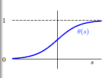
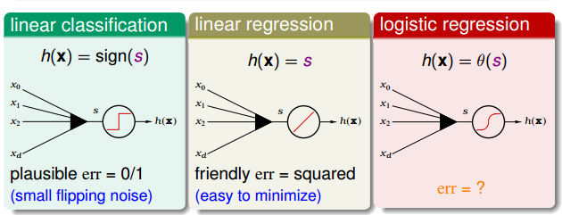
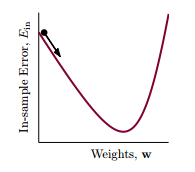
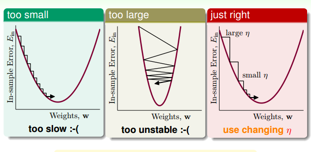

## 逻辑回归

#### 逻辑回归的问题

在[线性回归](./2017-12-05-linear-regreesion.md)这篇文章中，讨论了使用线性模型进行回归学习。PLA（perectron learing althro，感知机学习算法）是一个进行分类任务的线性模型。那如果现在我接到了老板的一个任务，除了能预测出这个用户明天会不会流失之外，我还要告诉我他有多大的可能性会流失，这个时候该怎么办？
此时，我们的预测目标是：

$$f(x)=p(+1|x)\in[0,1]$$

即，要预测出一个0到1之间的值，表示概率值。

我一看预测目标是0到1之间，是个连续的实数，是个回归任务嘛，如果我能有一批用户数据，每个用户数据都有对应的流失概率，我用线性回归去做一下预测，计算一下$w_{LIN}$就好了嘛，这有什么难的。
我想像中的数据：

$$ \begin{aligned}

(x_1, y_1\prime =0.9=p(+1|x_1))  \\
(x_2, y_2\prime =0.2=p(+1|x_2))  \\
...                              \\
(x_N, y_N\prime =0.6=p(+1|x_N))  \\
\end{aligned}
$$

然后我去数据库中提取数据，然后我傻眼了，以往的数据中，只有一个客户流失了还是没流失，谁会告诉我流失的概率是多大啊。实际我能有的数据只能是这样的：

$$ \begin{aligned}

(x_1, y_1 = 1=p(y|x_1))  \\
(x_2, y_2 =-1=p(y|x_2))  \\
...                              \\
(x_N, y_N =-1=p(y|x_N))  \\
\end{aligned}
$$

那现在问题来了，怎样用二分类的样本，在假设空间H中找到一个优秀的假设g，然后用这个g去计算老板需要的概率呢？回归一下上一篇文章里的线性回归和使用线性回归分类：线性回归$y=w^TX$得到了一个实数值，把符号函数$sign$应用到这个实数值上把输出值变为-1和1，就可以用来分类了。那么如果能有一个函数把$w^TX$映射到0到1之间，这样不是可以解决概率的问题吗。那么有这样的一个函数吗？答案当然是有了。他就是logistic function，也叫对数几率函数。

$$\theta(z)=\frac{e^z}{1+e^z}=\frac{1}{1+e^{-z}}$$

logistic 函数的图像如下所示：

从函数的图像可以看出，logistic函数是一个单调递增的、连续的`sigmoid`函数。

$$\theta(-\infty) = 0$$ 
$$\theta(0)=0.5 $$
$$\theta(+\infty)=1$$

而且logistic函数还有一个很好的性质，对称性。这条性质在后面会有很大的用处。

$$1-\theta(s) = \theta(-s)$$

现在我用logistic函数把$w^TX$转换为概率，logistic的假设空间就变成了：

$$h(x)=\theta(w^Tx)=\frac{1}{1+exp(-w^TX)}$$

#### 误差函数

我们要在假设空间中找到一个最优的函数g去近似理想的函数f(x)。从线性回归那里，我得到一个经验就是，如果要找到一个最优的函数，那我得先找到假设的函数g和理想函数f(x)之间误差的表示方式，然后把误差最小化，误差最小时的那个假设函数就是我要找到最优假设g。

由[前一篇](./2017-12-05-linear-regreesion.md)文章我们知道，线性模型的打分函数是$s=w^TX$。当线性分类时，误差函数为0/1误差，当线性回归时为均方误差，那么逻辑回归时，误差函数该怎么定义呢？

看一下我们的目标函数f(x)=p(+1|x)$$，是x是正例时的概率，那么x是负例的概率就是$1-f(x)$， 等价于:

$$
p(y|x)=\left\{
\begin{aligned}
f(x) &  & y=+1 \\
1-f(x) &  & y=-1 
\end{aligned}
\right.
$$

那么我们考虑这样的一个样本集$D=\{(x_1, \circ), (x_2, \times), ..., (x_N, \times)\}$：

根据贝叶斯定理,可以推测出数据集D由f产生的概率为：

$$p(x_1)p(\circ|x_i)*p(x_2)p(\times|x_2)*...*p(x_N)p(\times|x_N)$$

把上式中的p(y|x)换成f(x)可以得到：

$$p(x_1)f(x_1)*p(x_2)(1-f(x_2))*...*p(x_N)(1-f(x_N))$$

由于f是理想的情况，是无法直接得到的，但可以通过学习得到一个假设h，因此可以根据假设h计算生成同样一个数据集的概率，这样的概率称为依然概率：

$$likehood(h) = p(x_1)h(x_i)*p(x_2)(1-h(x_2))*...*p(x_N)(1-h(x_N))$$

由logsitic函数的对称性：

$$likehood(h) = p(x_i)h(x_i)*p(x_2)h(-x_2)*...*p(x_N)h(-x_N)$$

如果假设h很接近于理想f，即$h\approx f$，那么h产生数据集D的概率应该很接近于f产生D的概率。而我们既然观察到了数据集D，说明f产生D的概率很大，所以:

$$likehood(h) \approx probability \space using \space f \approx large $$

因此，可以因为假设空间H中最优秀的那个g应该是似然概率最大的那个，即：

$$g = argmax_h \space likehood(h) $$

而：

$$likelihood(logistic\space  h) \propto \prod_{n=1}^{N}h(y_nx_n)$$

逻辑回归的目的就是找到一个h，使得上式最大化。由于每个h都和一个w关联，因此把w带入h的定义，上式可以写为：

$$likelihood(logistic\space  w) \propto \prod_{n=1}^{N}\theta(-y_nw^Tx_n)$$

根据对数函数的性质$log(a+b)=log\space a+log\space b$、$log\space (\frac{1}{a}) = -log\space a$且对一个函数取对数不会改变这个函数的单调性，我们可以对上面的式子取对数，使得连乘变成连加：

$$
\begin{aligned}
& & {max}_w \prod_{n=1}^N\theta(-y_nw^Tx_n) \\
\leftrightarrow & & max_w ln  \prod_{n=1}^N\theta(-y_nw^Tx_n) \\
\leftrightarrow & & max_{\bf w} \sum_{n=1}^N ln\theta(-y_nw^Tx_n) \\
\leftrightarrow & & min_{\bf w} \sum_{n=1}^N -ln\theta(-y_nw^Tx_n)\\
\leftrightarrow & & min_{\bf w} \sum_{n=1}^N ln(1+exp(-y_nw^Tx_n))   
\end{aligned}
$$

记$err(w,x_n,y_n) = ln(1+exp(-y_nw^Tx_n))$为交叉熵误差函数函数，那么$\frac{1}{N}\sum_{n=1}^{N}ln(1+exp(-y_nw^Tx_n))$就是逻辑回归的训练误差$E_{in}$。
即：

$$min_{\bf w}E_{in}(w) = min_{\bf w}\frac{1}{N}\sum_{n=1}^{N}ln(1+exp(-y_nw^Tx_n))$$

#### 逻辑回归中的梯度

有了误差函数，剩下的问题就是怎么求最优的w的问题。经过分析发现，交叉熵误差函数也是一个连续的、二次可微的凸函数，我们仍然可以通过求梯度，让梯度等于0来求$E_{in}$的最小值。即$\nabla E_{in}(w)=0$。
对$E_{in}(w)$进行求导:

$$
\frac{\partial E_{in}(w)}{\partial w_i} 
= \frac{1}{N} \sum_{n=1}^{N} \frac{exp(-y_nw^Tx_n)}{1+exp(-y_nw^Tx_n)}(-y_nx_{n,i})
= \frac{1}{N} \sum_{n=1}^{N}\theta(-y_nw^Tx_n)(-y_nx_{n,i})
$$

因此$E_{in}$的梯度用向量的形式可以表示为：

$$\nabla E_{in}(w) = \frac{1}{N} \sum_{n=1}^{N}\theta(-y_nw^Tx_n)(-y_nx_n)$$

接下来试着求解$\nabla E_{in}(w)=0$。
注意一下上面的式子，梯度是一个带权的求和，权值是$\theta$。既然梯度是一个加权求和，那么当所有的权值，即$\theta$都是0的时候，就可以使得梯度等于0。那么梯度在什么时候等于0呢，根据$\theta$的定义，即logistic函数的性质，我们知道只有当$y_nw^Tx_n>>0$(趋向于无穷大)时，$\theta$才等于0。这就是说$y_n$ 和 $w^Tx_n$要同号，也就是说我们的数据集D是线性可分的。但是梯度是一个加权求和，并不是一个$w$的线性方程，并不能像线性回归那样求得一个解析解。

那么怎么求解最优的w呢，这里介绍一种迭代优化方法，即梯度下降。

####梯度下降

迭代优化方法的思想可以表示如下：
对 $t = 0, 1, ...$

$$w_{t+1} \leftarrow w_t + \eta v$$

这里，$v$代表更新方向，$\eta$代表步长。当算法终止时，将得到一个w，这个w就对应了最优的g。

对于向逻辑回归这样的非线性误差函数，当给定了$\eta>0$，我们需要找到一个方向$v$，去一步步的减少误差，就像一个处在山顶的小球，要沿着一个方向滚下山。为了简单起见，先假设每一步都走单位长度，误差函数为${min}_{\|v\|=1} \space E_{in}(w_t + \eta v)$。

但此时的误差函数仍然是一个非线性的函数，而且加了$\|v\|=1$的限制，并不比求解$min\space E_{in}(w)$容易。对于任何一条曲线，如果只考虑很小的一段时，都可以近似为一条直线，这样把非线性的函数转成了线性函数，可以降低我们的复杂度。当\eta足够小时，根据太累展开有：

$$E_in(w_t + \eta v) \approx E_{in}(w_t) + \eta v^T \nabla E_{in}(w_t)   $$

在这个式子中，$E_{in}(w_t)$是一个常数，$\eta$是一个给定的大于0的数，\nabla E_{in}(w_t) 可以根据误差函数求出来的，只有$v$是需要我们确定的。数学中学习导数，我们知道，梯度的几何意义就是函数增加最快的方向。具体来说，对于函数$f(x,y)$,在点$(x_0,y_0)$，沿着梯度向量的方向就是$(\partial f/\partial x_0, \partial f/\partial y_0)$T的方向是f(x,y)增加最快的地方。那么我们沿着梯度的反方向向下走，就是最快的方向了，最好的$v$就是梯度的反方向，而且我们要求$v$是单位向量，所以有：

$$v = - \frac{\nabla E_{in}(w_t)}{\|\nabla E_{in}(w_t)\|}$$

把这个v代入到迭代优化的式子中，可以得到$w_t$沿着梯度的方向走一步就得到了$w_{t+1}$:

$$w_{t+1} \leftarrow w_t - \eta \frac{\nabla E_{in}(w_t)}{\|\nabla E_{in}(w_t)\|}$$
这个方法通常称为梯度下降。

这时，我们来看一下什么样的$\eta$是不好的方向。

像上面的图一样，如果$\eta$太小，一步走的路程太短，下降的速度很很慢，造成迭代次数增多，下降很慢。而当$\eta$太大时，我们以为是在一条直线上下降，而实际上却有可能跨过最小点，走到对面的山坡，造成震荡的情况。当坡度比较大的时候，我们可以选择稍微大一点的$\eta$，使下降的速度快一点，而当坡度很小的时候，要适当的减小$\eta$，使得跨一步不至于太大，而跨过最小点。因此合适的$\eta$要根据坡度的大小来调整，即:

$$ \eta \propto \|\nabla E_{in}(w_t)\| $$

由于$\eta$和 $\|\nabla E_{in}(w_t)\|$，回头看下$w_{t+1}$的更新式子，分母正是$\|\nabla E_{in}(w_t)\|$，如果用$\hat{\eta}$ 表示$\frac{\eta}{\|\nabla E_{in}(w_t)\|}$, 那么$w_{t+1}$更新的式子可以表示为：

$$w_{t+1} \leftarrow \hat{\eta} \nabla E_{in}(w_t)$$

由于$\eta$和$\|\nabla E_{in}(w_t)\|$ 正相关，那么如果我们可以让$\eta$和$\|\nabla E_{in}(w_t)\|$成比例，此时，$\hat{\eta}$就是个常数。为了方便，我们把$\hat\eta$上的帽子去掉，扔记做$\eta$，即，$w_{t+1}\leftarrow \eta \nabla E_{in}(w_t)$。通常，我们把$\eta$称为学习率。

所以，逻辑回归的学习算法应该是:

初始化一个$w_0$

对 $t = 0, 1, ...$

1. 计算 
 
    $$\nabla E_{in}(w_t) = \frac{1}{N} \sum_{n=1}^{N}\theta(-y_nw_t^Tx_n)(-y_nx_n)$$

2. 更新

    $$w_{t+1} \leftarrow \eta \nabla E_{in}(w_t)$$

直到$\nabla E_{in}(w_{t+1}) \approx 0$ 或者已经迭代了足够多的次数。此时得到的$w_{t+1}$就是最优的假设。

