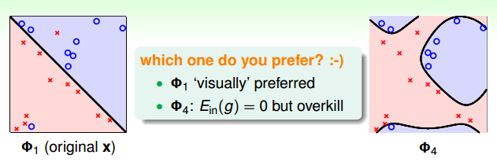
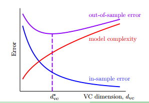

#### 二次空间假设

在讲非线性转换之前，我们先回顾一下线性空间假设。
1. 从视觉上来看，分割平面是线状的（对于多维空间是超平面）
1. 从数学上来看，得分函数是线性的，$s=w^Tx$
1. 从统计学上来看，$d_{vc}$(VC维)是有限的，即训练误差$E_{in}$和测试误差$E_{out}$是有限的。

但线性空间假设只对线性可分的数据有效，对于某些线性不可分的数据，不论假设空间中什么样的直线（超平面）都会有很大的$E_{in}$。那么怎么去突破线性模型的限制呢？

对于像上图这样的样本$D$来说，我们无法用一条直线正确地把数据集分类两类，但可以用一个圆心在原点，半径为$\sqrt{0.6}$的圆把所有的样本正确的分类。此时的假设为：

$$h_{sep}(x) = sign(-x_1^2-x_2^2+0.6)$$

那么我们是否把之前学过的PLA、逻辑回归、线性回归等算法应用到圆圈可分的数据集上呢?

看下上面的假设$h_{sep}(x)$，分别令

$$x_1^2=z_1$$

$$x_2^2=z_2$$

常数项为$z_0$, 每一项对应的系数为$\tilde{w_0}\space\tilde{w_1}\space\tilde{w_2}$, 则圆圈可分的假设空间为：

$$h(x) = sign(-x_1^2-x_2^2+0.6)=sign(\tilde{w}^Tz)$$

看到这个式子，是不是很熟悉，这就是线性模型的灵魂，评价函数的形式。

其实这个式子所做的事情就是把原来X空间里面的点都转化到Z空间里面，即把X空间中的每一个点的两个分量分别平方之后，转换到Z空间中,即$\{(x_n, y_n)\} \rightarrow\{(Z_n, y_n)\}$。数据就变成了线性可分的（如上图所示）。

我们把这样的转换叫做特征转换(feature transform) $\phi$:

$$x\in X \frac{\phi}{\rightarrow}z\in Z $$

经过了一番转换，我们可以在Z空间中找到一条直线把数据给正确的分成两类。

X空间中的数据是圆圈可分的，经过特征转换到Z空间中一定是线性可分的。那么反过来，在Z空间中是线性可分的，是不是说明X空间中的数据肯定是圆圈可分的呢？我们来看一下上面的特征转换$(z_0, z_1, z_2) = Z = \phi(x) = (1, x_1^2, x_2^2)$。 在Z空间中的假设空间为：

$$h(x)=\tilde h(Z)=sigh(\tilde{w}^T\phi(x))=sigh(\tilde{w}_0+\tilde{w}_1x_1^2+\tilde{w}_2x_2^2)$$

这个假设空间中的假设和$tilde{w}=(\tilde{w_0},\tilde{w_1},\tilde{w_2})$的取值有关，我们来看一下当$\tilde{w}$取不同值时，X空间中曲线的形状。

- (0.6, -1, -1): 圆(圆内的样本是圈圈)
- (-0.6, 1, 1): 圆(圆外的样本是圈圈)
- (0.6, -1, -2): 椭圆
- (0.6, -1, +2): 双曲线
- (0.6, +1, +2): 所有的样本都是圈圈

由此可见，Z空间中的直线对应了X空间中不同的二次曲线，对于这个转换来说，这些二次曲线是有限制的，即对称点都在原点，是一些特殊的曲线。那么如何对于到所有可能的二次出现呢？那我们需要把表示二次出现所有的项都包含进来，即：

$$\phi_2(x)=(1, x_1, x_2, x_1^2, x_1x_2,x_2^2)$$

可以把X空间中所有的二次曲线转换到X空间中，此时的假设空间为：

$$H_{\phi_2}=\{h(x):h(x)=\tilde{h}(\phi_2(x))\space for\space some\space linear\space \tilde{h}\space on\space Z\}$$

现在我们可以把圆、椭圆、双曲线、旋转过的椭圆等二次曲线都转换到Z空间。直线和常数作为二次曲线的特例，也可以被转换到Z空间。那么接下来的问题就是如何学习一个好的二次假设g了。

#### 好的二次假设

在上一部分，我们说X空间中的的二次曲线，都可以映射到Z空间中的直线，Z空间中的直线也对应了X空间中的二次曲线。如果我们想要在X空间中找到一个好的二次曲线假设，我们只要在X空间中找到一个好的直线假设，就可以反过来映射到X空间中。

既然我们可以用X空间中的数据集$\{(x_n,y_n)\}$，使用PLA，逻辑回归等方法，找到一个很好的假设，那么对于Z空间中的数据$\{Z_n=\phi_2(x_n), y_n\}$，我们当然可以利用上述算法找到一个好的直线。简单来说，整个步骤如下：

1. 首先用转换函数$\phi$把原始数据$\{(x_n,y_n)\}$转换到Z空间$\{Z_n=\phi_2(x_n), y_n\}$。
1. 利用数据集$\{(z_n,y_n)\}$，和自己喜欢的线性分类算法$A$去学习一个好的$\tilde{w}$。
1. 返回$g(x)=sign(\tilde{w}^T\phi(x))$

上述步骤中，特征转换函数$\phi$和学习算法$A$都是有多种方案可以选择的。如学习算法、可以选择PLA、逻辑回归或者其他分类算法，同样地，特征转换函数可以是三次、四次直到n次。

#### 特征转换的代价

如果一个数据集有d个特征，即$X\in R^d$，经过二次转换函数$\phi_2(x)$转后之后的$z=\phi_2(x)$有多少个维度呢？

转换之后，首先由1个常数项，d个一次项，d个$x_i^2$项，还有$C_d^2$个$x_ix_j$项，加起来总共有$\frac{1}{2}d^2+\frac{3}{2}d+1$项。由此可见经过二次转后后的特征比X空间中多了很多维。那么推广到Q次的多项式转换会增加多少维特征呢？

$$\phi_Q(x)=\left(
\begin{aligned}
1,\\
x_1,x_2,...x_d \\
x_1^2,x_1x_2,...,x_d^2 \\
..., \\
x_1^Q,x_1^{Q-1}x_2,...,x_d^Q
    \end{aligned}\right)$$

可以算一下，对Q次的转换，转换之后的维度为:

$$1+\tilde{d}=C_{Q+d}^Q=O(Q^d)$$

也就是说要花$O(Q^d)$的时间和空间来计算$z=\phi_Q(x)$和$\tilde{w}$。所以说当Q越大的时候，计算的复杂度越大。

除了计算复杂度增加了之外，自由参数的数量也从X空间的$1+d$个增加到了Z空间的$1+\tilde{d}$个，VC维增加到了$1+\tilde{d}$，这可能会引起过拟合的问题。

像上面的这个图，同样的数据集，左边是用线性分类找出的一个直线分割面，右边是用一个4次曲线转换之后找到的分隔曲线。虽然直线的分割面把训练集的一些点分错了，但那些点离自己正确的类别非常远，有理由认为这些点是噪声点，$E_{out}$和$E_{in}$很接近。而右边的曲线分割面，虽然把所有训练样本的点都分正确了，$E_{in}$是0，但实际情况中，$E_{out}$可能非常大，即泛化能力很差。

所以做非线性转换并不是没有代价的，首先它带来计算和存储上的复杂度，其次有可能导致过拟合的问题。因此，要不要做非线性转换，如何做非线性转换就是一个值得考虑的问题。

那么怎样挑选一个合适的非线性转换次数。对与二维或者三维的数据，我们可能会想把数据可视化，看看数据的分布，然后来挑选一个合适的Q。但如果是4维、5维甚至上百维的数据呢，我们没法形象的把数据可视化出来。此时应该怎么办呢？

#### 结构化的假设空间

我们先定义0维的变换为:

$$\phi_0(x)=(1)$$

那么一维的变换就是常数再加上所有的一次式:

$$\phi_1(x)=(\phi_0(x), x_1,x_2,...x_d)$$

二次变换为一次变换加上所有的二次式:

$$\phi_2(x)=(\phi_1(x), x_1^2,x_1x_2,...x_d^2)$$

三次变换为：

$$\phi_3(x)=(\phi_2(x), x_1^3,x_1^2x_2,...x_d^3)$$

以此类推,Q次的变换为：

$$\phi_Q(x)=(\phi_{Q-1}(x), x_1^Q,x_1^{Q-1}x_2,...x_d^Q)$$

即，高次的变换包含了低次的变换，低次的变换是高次变换的特例，这样的假设空间结构是嵌套的。

$$H_{\phi_0}\subset H_{\phi_1}\subset H_{\phi_2}\subset H_{\phi_3}\subset ... \subset H_{\phi_Q}$$

它们的VC维也符合下面的不等式:

$$d_{vc}(h_0)<=d_{vc}(h_1)<=d_{vc}(h_2)<=d_{vc}(h_3)<=...$$

那么它们的$E_{in}$也符合下面的关系:

$$E_{in}(g_0)>=E_{in}(g_1)>=E_{in}(g_2)>=E_{in}(g_3)>=...$$

像下图展示的那样：

随着VC维的增加，$E_{in}$越来越小，但模型复杂度越来越高和$E_{out}$也越来越大。假如一个初学了非线性变换的人，用100多次的变换跑出来一个模型，做到了$E_{in}=0$，很高兴的想，你看我的模型很厉害，误差是0了呢。但这时候其实是很危险的，因为很可能模型是过拟合了，$E_{out}$很可能是非常大的。那么安全的做法是先从一维的变换，即线性分类开始，如果能够得到一个不错的$E_{in}$，我们就可以很开心的停止模型的训练了。如果$E_in$很大，不满足我们的需求，我们才考虑用更高次的变换。
