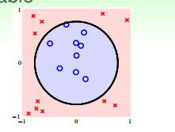
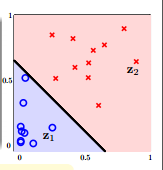

#### 二次空间假设

在讲非线性转换之前，我们先回顾一下线性空间假设。
1. 从视觉上来看，分割平面是线状的（对于多维空间是超平面）
1. 从数学上来看，得分函数是线性的，$s=w^Tx$
1. 从统计学上来看，$d_{vc}$(VC维)是有限的，即训练误差$E_{in}$和测试误差$E_{out}$是有限的。

但线性空间假设只对线性可分的数据有效，对于某些线性不可分的数据，不论假设空间中什么样的直线（超平面）都会有很大的$E_{in}$。那么怎么去突破线性模型的限制呢？

对于像上图这样的样本$D$来说，我们无法用一条直线正确地把数据集分类两类，但可以用一个圆心在原点，半径为$\sqrt{0.6}$的圆把所有的样本正确的分类。此时的假设为：

$$h_{sep}(x) = sign(-x_1^2-x_2^2+0.6)$$

那么我们是否把之前学过的PLA、逻辑回归、线性回归等算法应用到圆圈可分的数据集上呢?

看下上面的假设$h_{sep}(x)$，分别令

$$x_1^2=z_1$$

$$x_2^2=z_2$$

常数项为$z_0$, 每一项对应的系数为$\tilde{w_0}\space\tilde{w_1}\space\tilde{w_2}$, 则圆圈可分的假设空间为：

$$h(x) = sign(-x_1^2-x_2^2+0.6)=sign(\tilde{w}^Tz)$$

看到这个式子，是不是很熟悉，这就是线性模型的灵魂，评价函数的形式。

其实这个式子所做的事情就是把原来X空间里面的点都转化到Z空间里面，即把X空间中的每一个点的两个分量分别平方之后，转换到Z空间中,即$\{(x_n, y_n)\} \rightarrow\{(Z_n, y_n)\}$。数据就变成了线性可分的（如上图所示）。

我们把这样的转换叫做特征转换(feature transform) $\phi$:

$$x\in X \frac{\phi}{\rightarrow}z\in Z $$

经过了一番转换，我们可以在Z空间中找到一条直线把数据给正确的分成两类。

X空间中的数据是圆圈可分的，经过特征转换到Z空间中一定是线性可分的。那么反过来，在Z空间中是线性可分的，是不是说明X空间中的数据肯定是圆圈可分的呢？我们来看一下上面的特征转换$(z_0, z_1, z_2) = Z = \phi(x) = (1, x_1^2, x_2^2)$。 在Z空间中的假设空间为：

$$h(x)=\tilde h(Z)=sigh(\tilde{w}^T\phi(x))=sigh(\tilde{w}_0+\tilde{w}_1x_1^2+\tilde{w}_2x_2^2)$$

这个假设空间中的假设和$tilde{w}=(\tilde{w_0},\tilde{w_1},\tilde{w_2})$的取值有关，我们来看一下当$\tilde{w}$取不同值时，X空间中曲线的形状。

- (0.6, -1, -1): 圆(圆内的样本是圈圈)
- (-0.6, 1, 1): 圆(圆外的样本是圈圈)
- (0.6, -1, -2): 椭圆
- (0.6, -1, +2): 双曲线
- (0.6, +1, +2): 所有的样本都是圈圈

由此可见，Z空间中的直线对应了X空间中不同的二次曲线，对于这个转换来说，这些二次曲线是有限制的，即对称点都在原点，是一些特殊的曲线。那么如何对于到所有可能的二次出现呢？那我们需要把表示二次出现所有的项都包含进来，即：

$$\phi_2(x)=(1, x_1, x_2, x_1^2, x_1x_2,x_2^2)$$

可以把X空间中所有的二次曲线转换到X空间中，此时的假设空间为：

$$H_{\phi_2}=\{h(x):h(x)=\tilde{h}(\phi_2(x))\space for\space some\space linear\space \tilde{h}\space on\space Z\}$$

现在我们可以把圆、椭圆、双曲线、旋转过的椭圆等二次曲线都转换到Z空间。直线和常数作为二次曲线的特例，也可以被转换到Z空间。那么接下来的问题就是如何学习一个好的二次假设g了。

#### 好的二次假设

