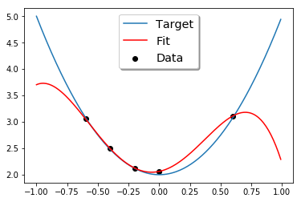
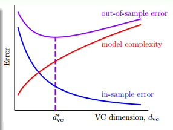
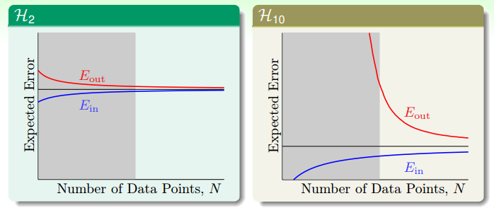
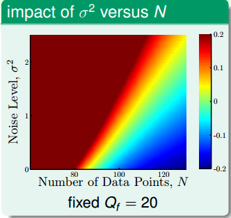
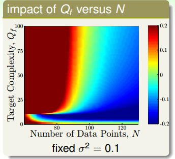

上一篇文章在讲述非线性转换的时候，提到了当非线性转换的次数很高的时候会使$E_{in}$很小，而$E_{out}$很大，并且把这种现象称为过拟合。这篇文章就来具体讲讲什么过拟合，过拟合是怎么产生的，如何处理过拟合。

## 什么是过拟合

先来看一个例子，现在要做一个一维的线性回归，有5个数据点，这5个数据点是一个二次函数$f(x)=3x^2+2$加上一些噪声产生的。然后用一个4次多项式去拟合这些数据。按照上一篇文章中的步骤，这里用python实现拟合的过程。

``` python
import numpy
import matplotlib.pyplot as plt
import random
from sklearn.linear_model import LinearRegression
from sklearn.model_selection import train_test_split

N = 10
x = numpy.array(numpy.arange(-1, 1, 0.2))
y = numpy.array([3*(i **2)+2 for i in x])
noise = numpy.array([random.uniform(-0.1,0.1) for i in range(N)])
Y = y + noise
c = numpy.ones(N)
# 用4次多项式进行非线性转换
X = np.c_[c,x, numpy.power(x, 2), numpy.power(x,3), numpy.power(x, 4)]
# 训练模型
x_train, x_test, y_train, y_test = train_test_split(X, Y, test_size=0.5)
model = LinearRegression()
model.fit(x_train, y_train)
#画图
test = numpy.arange(-1, 1, 0.01)
plt.plot(test,3*numpy.power(test, 2)+2 )
plt.scatter(x_train[:,1], y_train, marker='o', color="black")

X_test = np.c_[numpy.ones(test.shape[0]),test, numpy.power(test, 2), numpy.power(test,3), numpy.power(test, 4)]
plt.plot(test, model.predict(X_test), color="red")
```
拟合的结果如下图所示：



由于训练数据只有5个数据点，而我们用一个4次的函数去拟合，肯定能过得到一条曲线，完美的拟合这5个数据点，即$E_{in}=0$，然而从图中，我们可以看到，拟合出的曲线和我们的目标函数很大的差别，即$E_{out}$很大，这个模型的泛化能力很差。实际上，$E_{in}$、$E_{out}$和VC维的关系就像下面的图像表示的那样，随着VC维越来越高，$E_{in}$越来越小，越来越接近于0，而$E_{out}$却越来越大。




VC维从小到大的过程中，如果$E_{in}$越来越小，但$E_{out}$越来越大，这时就发生了过拟合(overfitting)。反过来，欠拟合就是指，VC维从大到小的过程中，$E_{in}$变大了，$E_{out}$也变大了，这说明模型不能很好地拟合数据。通常来说，欠拟合的情况很好解决，只有增加VC维就好了,但过拟合是一个比较难以解决的问题。

## 过拟合是怎么产生的

过拟合的一个原因是，使用了过大的VC维，这就像开车开太快会比较容易发生车祸一样；另一个原因是数据集有噪声，这就像是差的路况也会增加出车祸的概率；第三个原因是数据集的数量有限，这就像是去到一个陌生的地方，对路况了解不多，也比较容易出事故。那么噪声和数据集的数量会对过拟合产生什么样的影响呢?

依然是一维的回归分析，我们产生两个数据集:
1. 目标函数是一个10次的多项式，数据集用这个目标函数产生，并加上一些噪声。
1. 目标函数是一个50次的多项式，数据集用这个目标函数产生。

然后分别用二次多项式($g_2\in H_2$)和10次多项式($g_{10}\in H_{10}$)来拟合这两个数据集。

当使用二次多项式和十次多项式分别拟合10次的目标函数时，E_{in}和E_{out}分别如下表所示:

|    | 二次多项式 | 十次多项式|
|:----|:----|:----|
|E_in|0.060|0.034|
|E_out|0.127|9.00|


从二次多项式到十次多项式的时候发生了过拟合。

当使用二次多项式和十次多项式分别拟合50次的目标函数时，E_{in}和E_{out}分别如下表所示:

|    | 二次多项式 | 十次多项式|
|:----|:----|:----|
|E_in|0.0029|0.00001|
|E_out|0.120|7680|


使用十次多现实拟合的时候，$E_{in}$非常小，但$E_{out}$却非常大。从二次多项式到十次多项式的时候发生了过拟合。

虽然在做拟合之前，我们已经知道了目标函数分别是10次和50次多项式，然而还是$H_2$的模型取得了比较小的$E_{out}$。这代表了机器学习中的一个哲学：以退为进。虽然简单的模型$E_{in}$比较大，但$E_{out}$却比较接近$E_{in}$。像下图中的学习曲线显示的那样，当数据集有限时，$E_{in}$会比期望的误差好一点，而$E_{out}$会比期望的误差坏一点。而如果是十次多项式的假设空间时，当N无穷大时，$E_{in}$和$E_{out}$也会接近于期望误差，而当N很小时，$E_{out}$却非常大。因此，当N很小时，使用简单的模型(VC维低)虽然不是十分完美，但却能得到一个比较好的结果。



拟合没有噪声的50次的数据样本时，虽然没有噪声，依然是2次多项式的拟合函数取得了较好的结果。因为有限的数据点不足与解释复杂的目标函数。

## 什么时候会发生过拟合

接下来用一个更细致的实验说明什么时候要小心过拟合的发生。把我们的数据集($y=f(x)+\varepsilon$)分为两个部分，一个是目标函数$f(x)$，另一部分是噪声$\varepsilon$。

1. 对数据集加一个强度为$\sigma^2$的高斯噪声，研究不同强度的噪声会对模型产生什么影响。
1. 数据集在$f(x)$是一个复杂度为$Q_f$次的函数上均匀分布。
1. 数据集的数量N

我们来研究这三个变量变化时，对过拟合产生的影响。

依然用二次多项式$H_2$和十次多项式$h_{10}$对数据集进行拟合。由于十次多项式的模型能力更强，它的$E_{in}$肯定要比二次多项式模型的要小。那么我们就用$E_out(g_{10}) - E_{out}(g_2)$来度量过拟合发生的程度。当两者的差别很大时，过拟合的情况肯定很严重。



上面这幅图的横轴是数据集的数量，纵轴是高斯噪声的强度$\sigma^2$，目标函数的复杂度固定在20次，图中的颜色代表过拟合的程度。颜色越红，过拟合的程度越高，颜色越蓝，过拟合的程度越轻。从图中可以看到，红色的区域集中在左上角，即当噪声很高，数据集很少的时候，蓝色区域集中在右下角，当数据集很多，而且资料很少的时候。



上面的这幅图，横轴依然是数据集的数量，纵轴是目标函数的复杂度，而高斯噪声的强度固定为1。跟上一幅图类似，目标函数的复杂度越高，数据集数量越少，越容易过拟合。值得注意的是，这这幅图的最下方，也有一个区域发生了过拟合。这是因为，当目标函数很简单是，用过于复杂、表达能力过强的模型($H_{10}$)也会发生过拟合的现象。这说明，复杂的模型往往做不好简单的题目。


从上面两幅图发现，我们加上去的高斯噪声会对过拟合产生很大的影响，我们把加上去的高斯噪声叫做随机噪声（stochastic noise）。第二幅图表面目标函数的复杂度也会对过拟合产生很大的影响，我们把这个叫做固定噪声(deterministic noise)。也就是说模型的复杂度跟高斯噪声一样，对过拟合都产生了类似于噪声的效果，差别在于一个是固定的，一个是随机产生的。从这两个图我们可以总结出4个可能会发生过拟合的地方:

1. 数据集数量太少
1. 随机噪声太强
1. 固定噪声太大（目标函数很复杂）
1. 模型太复杂（VC维过高）

## 如何避免过拟合

1. 从简单的模型开始
1. 数据清理(data cleaning/pruning)
1. data hinting，对现有数据的了解，去产生更多的数据
1. 正则化
1. 验证(validation)

这里先简单说一下data cleaning, pruning 和 hinting，至于正则化和验证会在以后的文章里讲。

数据清理即删除异常点。比如一个数据集被标记为0，但却和标记为1的数据集聚在一起，就可以把这个数据的标记改为1（cleaning），或者直接丢掉（pruning）。数据清理说起来很简单，但困难的地方在于如何侦测哪些数据点是异常点。数据清理的方法可能会有用，但并不是时时都有用。比如分类时，正例和负例都非常多，那偶尔有一个异常点也不会对模型造成很大的影响。但在有些例子里面会产生较大的影响。

在手写字体识别的例子中，假如我们收集到的数据集比较少，我们可以把现有的数据集稍稍的做一下平移和旋转，他们仍然代表同样的数字，这样可以增加样本量。这样用我们造出来的虚拟样本(virtual examples)，加入数据集的做法就是 data hinting。这有可能会有用，但要非常小心。因为此时的训练集的分布已经和原始数据集分布不一样了。所以一定要根据学习任务的特征和数据集特点去小心的产生虚拟样本。
