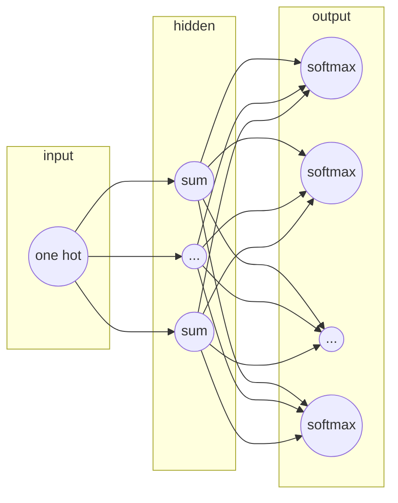

word2vec的两种模型:
- CBOW
- skip gram

skip gram 模型的结构:

参数数目: 2 * d * V 
其中d是隐藏层的数目也是最后输出的词向量的维数。V是词典的大小，也就是语料集中共有V个不同的词。输入层到隐藏层的权重矩阵U是一个V*d的矩阵。由于输入是一个one-hot向量, 输入向量x隐藏层矩阵的乘积$XU$(假设x是第t个词)刚好是U的第t行，因此可以把矩阵U看做是一个`lookup table`。而隐藏层到输出层的矩阵是中心词的上下文矩阵。

求解方式的优化:
- negative sampling
- Hierarchical softmax

##### negative sampling
1. Treating common word pairs or phrases as single "words" in the model, 把经常出现在一起的短语看做一个词
2. Subsampling frequent words to decrease the number of training examples， 对高频词进行下采样，减少训练样本的数目
3. Modifying the optimization objective with a thechniuqe they called "Negative Sampling", which causes each training sample to update only a small percentage of the model's weights. 用`负采样`的技术减少每个训练样本更新的参数数目。

###### Word Pairs and "Phrases"

把常见的搭配和短语看做一个词，减少词汇总数。

###### Subsampling Frequent Word

word2vec是一个具有一层的神经网络。输入向量是语料中的每个词，训练目标是这个词周围的词。周围的词是

