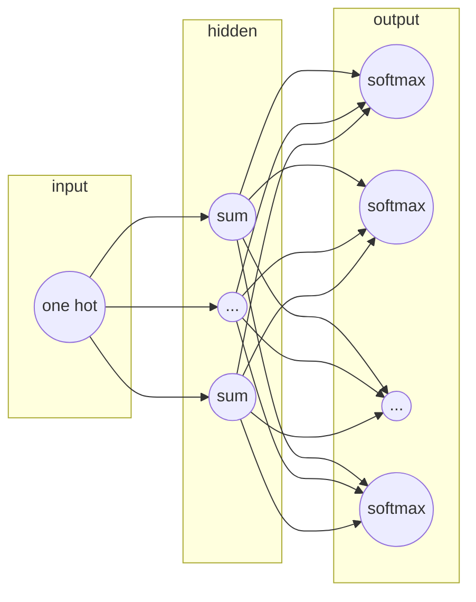
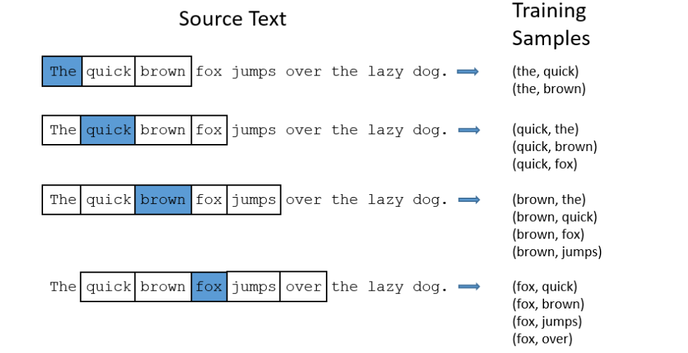
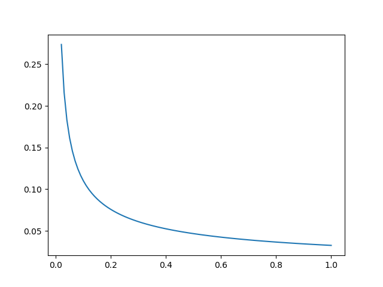

word2vec的两种模型:
- CBOW
- skip gram

skip gram 模型的结构:

参数数目: 2 * d * V 
其中d是隐藏层的数目也是最后输出的词向量的维数。V是词典的大小，也就是语料集中共有V个不同的词。输入层到隐藏层的权重矩阵U是一个V*d的矩阵。由于输入是一个one-hot向量, 输入向量x隐藏层矩阵的乘积$XU$(假设x是第t个词)刚好是U的第t行，因此可以把矩阵U看做是一个`lookup table`。而隐藏层到输出层的矩阵是中心词的上下文矩阵。

求解方式的优化:
- negative sampling
- Hierarchical softmax

### negative sampling
1. Treating common word pairs or phrases as single "words" in the model, 把经常出现在一起的短语看做一个词
2. Subsampling frequent words to decrease the number of training examples， 对高频词进行下采样，减少训练样本的数目
3. Modifying the optimization objective with a thechniuqe they called "Negative Sampling", which causes each training sample to update only a small percentage of the model's weights. 用`负采样`的技术减少每个训练样本更新的参数数目。

#### Word Pairs and "Phrases"

把常见的搭配和短语看做一个词，减少词汇总数。

#### Subsampling Frequent Word

word2vec是一个具有一层的神经网络。输入向量是语料中的每个词，训练目标是这个词周围的词。周围的词是只一个窗口内的词，比如window=5就是中心词t前的5个词和后面的一个词。下图是以window=2为例，展示了word2vec训练样本的生成过程。

对于像"the"这样的高频词，有两个问题：
1. 词语对（"for", "the"）并不能告诉我们"fox"的意义，"the"在许多词语的上下文环境中都会出现。
2. 包含有"the"的词语对("the",...)很多，而学习一个好的向量表示"the"并不需要很多词语对。

Wprd2Vec用`下采样`来解决上面的两个问题。对于训练集中的每个词，都有一定的概率把它从文本中删掉，删掉的概率和词频有关。

假如窗口的长度是10，把某个词（比如‘the’）移除之后，会有下面两个效果：

1. 当我们训练剩下的词的，并不是所有的词都要和“the”配对。
2. 当“the”是中心词的时候，我们的训练样本会少于10个。

这样就可以解决了上面说的两个问题。

##### Sampling rate

在Word2vec 的C代码中，有个公式决定了一个词被保留在语料中的概率。
假设$w_i$是词，$z(w_i)$是词$w_i$在语料中出现的次数和语料中所有词的总次数的比值。例如，单词“peanut”出现了1000次，预料中总次数是100000000，那么$z('peanut')=1E-6$。

在代码中，有个变量是`sample`决定了下采样的比率，`sample`的默认值是0.001。`sample`的值越小，说明词被删掉的概率越大。

一个词被保留的概率$P(w_i)$用如下方式计算：
$$
P(w_i) = (\sqrt \frac{z(w_i)}{0.001} + 1) \dot \frac{0.001}{z(w_i)}
$$

用`Python`把这个式子画出来，可以看到，当$z(w_i)$很小时，$P(w_i)$比较大，而当$z(w_i)$很大时，$P(w_i)$很小。

- 当$z(w_i)<=0.026$时，$P(w_i)=1.0$，也就是说，只有词语出现的频率大于0.26%时才会被下采样
- 当$z(w_i)=0.00746$时，$P(w_i)=0.5$，一半的词会被保留。
- 当$z(w_i)=1$时，$P(w_i)=0.033$，也就是说当整个语料集只有一个词时，只有3.3%的机会会被保留。但这样的语料当然是很荒谬了。

####  负采样 Negative Sampling

训练一个神经网络意味着，当一个训练集喂给网络时，我们对所有神经元的权重做微调，使网络对这个样本的预测更加准确。也就是说，每个训练集都会改变神经网络中的所有权重。

前面我们算过，word2vec中的参数的数目跟词典数目成正比。一般一个语料集中的词语数目都是几十万甚至上百万，这也意味着神经网络中巨大的参数数目。Word2vec中训练集的数目通常会更多，有可能到上亿词。如果每次都调整所有神经元的权重，计算量将非常大。

为了减少计算量，`负采样`每次只更新小部分参数，而让大部分参数保持不变。当训练样本是("fox","quick")时，神经网络的输出是一个ont-hot向量，只有对应于"quick"的神经元应该输出1，其他神经元都是0。当进行`负采样`时，我们随机选择数目很小的一些`负词`进行权重的更新。在这里`负词`是指神经元的期望输出是0的词。同时，`正词`(在这个例子里就是"quick")的权重也会被更新。**这里所说的更新都是隐藏层到输出层的权重。**

    论文表明对于小的数据集，5-20个词表现会很好，大的数据集只需要更新2-5个词。

假设我们词表的数目是10000，隐藏的节点数是300， 那么整个网络的参数是200*10000。但使用`负采样`每次训练只需要更新`正词`("quick")和其他的5个`负词`。也就是6个神经元，1800个参数。无论使用`负采样`与否，输入层到隐藏层的参数都是只更新中心词的参数。

##### Selecting Negative Samples

`负词`的采用是根据`unigram distribution`（一元语言模型）进行的。本质上来说，选择一个词做`负词`的概率和这个词的频率有关，高频词被选中的概率越高。

在word2vec中，这个概率的计算方式如下:

$$
P(w_i) = \frac{z(w_i)^{\frac34}}{\sum_{j=0}{n}(z(w_i)\frac34)}
$$

论文中，根据实验决定用3/4次方而不是频率本身。

在C代码中，`负采样`的实现也很有意思。他们用了一个有100M元素的数组代表unigram 词表。数组中的元素是词在词表中的索引。每个索引出现的次数等于$P(w_i)*table_size$。当进行一次`负采样`时，只要生成一个在0到100M之间的随机数，数组在这个位置的词就是所谓的`负词`。概率越大的词的索引在数组中出现的次数越多，因此，被采集到的机会也越大。

参考:
    [word2vec-tutorial-part-2-negative-sampling](http://mccormickml.com/2017/01/11/word2vec-tutorial-part-2-negative-sampling/)
    作者还对谷歌开源的C代码做了注释，有时间可以看一下。