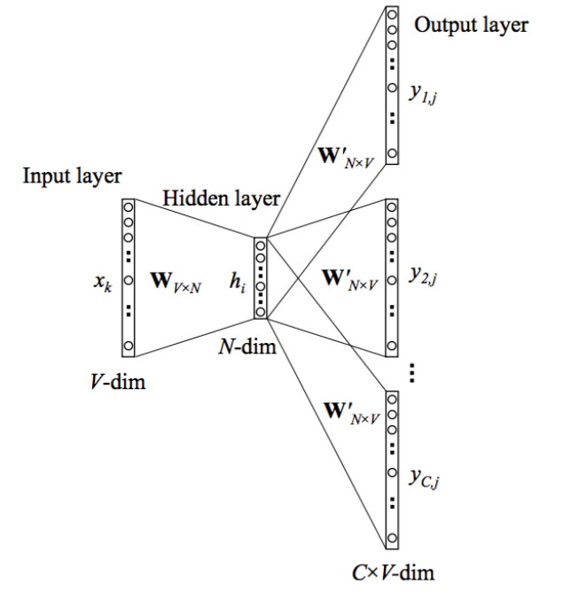

<!--

-->

## skip gram model

skip gram 模型简单的来说就是用语料集中的一个词语来预测其周围的词语。其输入时一个词语$W_I$，假设窗口宽度为C，输出是$W_I$的上下文$\{W_{O,1},W_{O,2},...,W_{O,C}\}$。比如"我/爱/自然语言处理/和/机器学习"这句话，如果让"自然语言处理"是输入词，那么输出就是{"我","爱","和","机器学习"}。神经网络当然不能直接处理单词，我们用长度为$V$的one-hot向量表示每一个单词，其中$V$是预料集中所有不同的单词数。one-hot向量对应于单词$W_I$的位置是1，其他元素都是0。我们可以从语料集中收集到大量的训练样本。
## Forward Propagation

skip-gram 模型的神经网络结构如上图所示。我们需要注意几个符号的表示:
- $x$是代表输入的one-hot向量。对应于输入的单词。其大小是$V\times1$，$V$是整个词表的大小。
- ${y_1, ..., y_C}$代表输出的one-hot向量。对应于输出的单词，也就是输入单词的上下文。
- 网络中只有一个隐藏层，其节点数是$N$。最后我们得到的词向量也是$N$。
- $W$是输入层到隐藏层之间的权重矩阵，大小是$V \times N$。由于输入是个one-hot向量，故单词$W_k$的向量和$W$的乘积就是$W$的第k行，因此可以把$W$看出是一个词向量表。$W$也是我们整个模型关注的重点。
- $W^\prime$是隐藏层到输出层之间的权重矩阵。是一个$N\times V$的矩阵。
- $h$是隐藏层的输入, 是输入向量和权重矩阵的乘积。由于输入向量只有一个位置$k$是1，因此$h$就是输入到隐藏层的权重矩阵$W$的第$k$行。
$$
h = x^TW = W_{(k,.)} := v_{w_k}
$$
&emsp;&emsp;其中$v_{w_k}$表示权重矩阵$W$的第$k$行向量。
- 由于隐藏层没有激活函数，所有$h$也是隐藏层的输出。
- $u_c$是第c个输出单词的输入。$u_c$是一个$V\times1$的向量。
$$
u_C = {W^\prime}^T h
$$
&emsp;&emsp;值得注意的是skip_gram模型共有$C$个需要预测的单词，可以把输出层看做是有$C\times V$个节点。但是每个预测单词都共享权重矩阵$W^\prime$，因此所有的$u_c$都是相同的。

&emsp;&emsp;第$c$个输出词的第$j$个节点的输入就是$u_c$的第$j$个元素。

$$u_{c,j}= W^\prime_{(.,j)}h =v^{\prime T}_{w_j}h$$
&emsp;&emsp;其中$v^{\prime T}_{w_j}$是$W^\prime$的第j列。

- 第$c$个输出词的第$j$个节点的输出通过`softmax`函数计算，`softmax`函数产生一个多项式分布。
$$p(w_{c,j}=w_{O,c}|w_I) = y_{c,j} = \frac{exp(u_{c,j})}{\sum_{j^\prime}^V exp(u_{c,j^\prime})}$$

&emsp;&emsp;$y_{c,j}$是在输入词是$w_I$的条件下，第$c$个输出词是词表中第$j$个词的概率。我们的训练目标就是要$y_{c,j}$等于真实的第$c$个输出词的第j个节点的值。输出是one-hot变化，我们知道真实的$y_{c,j}=1$，如果第$c$个输出词是词表中第$j$个词的话，否则是0。

## Learning the Weights with Backpropagation and Stochastic Fradient Desecent 用后向传播和随机梯度下降学习权重矩阵
上面的这个过程就是输入以前向传播的方式经过神经网络产生输出的过程。最初网络中的两个权重矩阵$W$和$W^\prime$是随机初始化的，我们可以通过后向传播和随机梯度下降方法学习这两个权重矩阵。

### 定义loss function

$$
E = -log p(w_{O,1},w_{O,2},...,w_{O,C}|w_I) \\

= -log \prod_{c=1}^C\frac{exp(u_{c,j_c^*})}{\sum_{j^\prime =1}^Vexp(u_{j^\prime})}  \\ 

= -\sum_{c=1}^C u_{j_c^*} + log \sum_{j^\prime=1}^V exp(u_{j^\prime})
$$

损失函数就是给定了输入词后输出词的条件概率的负对数。其中$j_c^*$是第$c$个输出词在词表中索引。我们的目标就是使条件概率的负对数最小。

### 推导输出层权重矩阵$W^\prime$的更新公式

先来推导一下隐藏层-输出层的权重矩阵$W^\prime$的更新公式。首先计算一下损失函数$E$对$u_{c,j}$的偏微分。根据链式法则:

$$
\frac{\partial E}{\partial u_{c,j}} = \frac{\partial {(-\sum_{c=1}^C u_{j_c^*} + log \sum_{j^\prime=1}^V exp(u_{j^\prime})})}{\partial u_{c,j}} \\

= - \frac{\partial (\sum_{c=1}^C u_{j_c^*}) }{\partial u_{c,j}} + \frac{\partial{(log \sum_{j^\prime=1}^V exp(u_{j^\prime}))}}{\partial u_{c,j}}
$$

先来看偏微分的第一项，只有当$j_c^*$和$(c,j)$相同时，才为1，否则为0。我们用$t_{c,j}$表示这一项的微分，即，当第c个输出词的第j个节点的真实值是1，$t_{c,j}=1$，否则$t_{c,j}=0$。

偏微分的第二项可以用链式法则求解：
$$
\frac{\partial E}{\partial u_{c,j}} = -t_{c,j} + \frac{1}{\sum_{j^\prime=1}^V exp(u_{j^\prime})} exp(u_c,j)
$$

我们可以看到偏微分的第二项刚好就是第c个输出词第j个节点的输出$y_{c,j}$。因此：
$$
\frac{\partial E}{\partial u_{c,j}} = y_{c,j}-t_{c,j}
$$

现在我们有了最后一层节点输入的误差导数，接下来我们继续用链式法则来纠结损失函数关于输出权重矩阵$W^\prime$的偏微分。

$$
\frac{\partial E}{\partial w^\prime_{ij}} = \sum_{c=1}^C \frac{\partial E}{\partial u_{c,j}} \frac{\partial u_{c,j}}{\partial w^\prime_{ij}}
$$

回想一下
$$u_{c,j}= W^\prime_{(.,j)}h =v^{\prime T}_{w_j}h$$

因此:

$$
\frac{\partial u_{c,j}}{\partial w^\prime_{ij}} = h_i
$$

所以:
$$
\frac{\partial E}{\partial w^\prime_{ij}} = \sum_{c=1}^C(y_{c,j} - t_{c,j}) h_i
$$

根据随机梯度下降算法，输出层权重矩阵$W^\prime$的更新公式为：

$$
w^{\prime (old)}_{ij} = w^{\prime (new)}_{ij} - \eta \sum_{c=1}^C(y_{c,j} - t_{c,j}) h_i
$$

其中 $\eta>0$ 是学习率。
### 推导输入层权重矩阵$W$的更新公式

继续使用链式face推导隐藏层权重矩阵$W$的更新公式:

$$
\frac{\partial E}{\partial w_{ki}} = \frac{\partial E}{\partial h_i} \frac{\partial h_i}{\partial w_{ki}}  \\ 

=\sum_{j=1}^V \sum_{c=1}^C(y_{c,j} - t_{c,j})\cdot W^\prime_{i,j} \cdot x_k

$$

最后隐藏层权重更新矩阵:
$$
w_{ij}^{new} = w_{ij}^{old} - \eta \sum_{j=1}^V \sum_{c=1}^C(y_{c,j} - t_{c,j})\cdot W^\prime_{i,j} \cdot x_k
$$

由此可以看出，每更新一个参数都需要对整个词表求和，计算量很大。Word2Vec的作者也此做了一些优化，如hierrachical softmax 和 [负采样(negative sampling)](./2018-07-13-word2vec.md)。